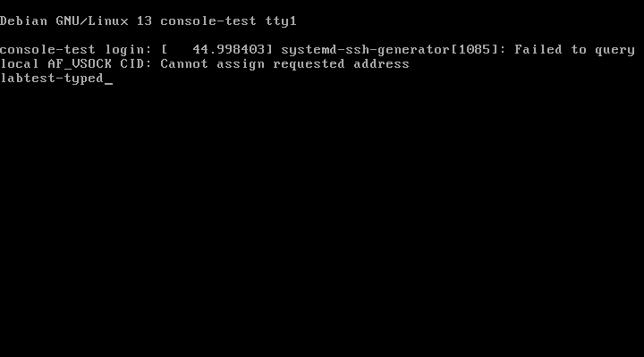

# Old Computer → AI Lab

[](https://github.com/jr551/proxmox-agent-lab/actions/workflows/ci.yml)
[](https://github.com/jr551/proxmox-agent-lab/releases/latest)
[](https://www.python.org/)
[](LICENSE)

**Give an old computer one more job: an on-demand lab an AI agent can wake,
use, and switch back off.**

Turn spare hardware into a safe, AI-operated compute pool. When there is work,
an agent powers the physical machine on, spins up a disposable Windows, Linux
or Android guest **from a template**, does the job — build and boot a kernel,
drive an installer, study software, drivers, firmware, memory, USB and network
behaviour — then destroys the guest and switches the computer back off,
*verified*. Between jobs, nothing runs and nothing is left on.

Built for home-lab hosting, kernel and OS development, authorized reverse
engineering, defensive security research, digital forensics, interoperability,
debugging and education. The Python package is **`proxmox-agent-lab`**; the CLI
is **`proxmox-lab`**.

```bash
curl -fsSL https://raw.githubusercontent.com/jr551/proxmox-agent-lab/main/install.sh | bash
```

<p align="center">
  
  <br>
  <em>👀 What the agent sees. A real screen capture from a running VM —<br>
  and the agent typed that text.</em>
</p>

---

## Why an old computer?

Containers cannot reproduce every kernel, driver, installer, USB device or
firmware interaction. A spare desktop running Proxmox can. It is cheap, local,
and physically separate from the computer holding your everyday work.

But a lab left running becomes a liability: wasted power, abandoned machines
and experiments that outlive the agent controlling them. Here, work happens in
a **lease**. Lease ends → guests destroyed → host powered off, *verified*.
Agent dies → a watchdog cleans up anyway.

## 🔁 On-demand environments for agents

The unit of work is a **lease**; the fastest way to fill one is a **template**.
Build a golden image once — a kernel-dev box, a specific distro, a Windows test
rig, a malware sled — then let the agent clone it on demand:

```text
host asleep → agent takes a lease → Wake-on-LAN powers the PC on →
clone the template → run the job → lease ends →
guest destroyed → host verified OFF
```

The template is the reusable part; every run is a fresh, identical, throwaway
copy of it, and nothing runs between jobs. That is what makes it safe to hand a
real kernel and root access to an autonomous agent: the blast radius is one
clone, and the machine powers itself down when the work is done. Need a service
to stay up instead? A **long-term lease** keeps the host on for exactly as long
as you want it — the same box is both an always-on home server and a disposable
agent lab.

## ⚡ What it can do

| | Capability | Command |
|---|---|---|
| 🖥️ | Create throwaway VMs and containers | `api`, clone a template |
| 👀 | **See and drive the screen** (input + settled PNG) | `console screenshot`, `--screenshot-after` |
| 🧠 | Guarded NVIDIA / OpenRouter / Kilo vision race | `console inspect` |
| 🖼️ | Hand the screen to your own vision as base64 | `console screenshot --for-model` |
| ⌨️ | **Type and click** | `console type`, `keys`, `click` |
| 🔧 | **Run commands** (picks the channel for you) | `guest run` |
| 📄 | Read a console as exact text | `console text` |
| 📦 | Move files in and out | `push`, `pull` |
| 🪟 | Install Windows | `windows install` |
| 💿 | Fetch cloud images, checksum-verified | `storage download-url` |
| 🧪 | Experimental trusted OCI application LXC | `oci pull`, `oci create` |
| 🔒 | Force all traffic through a VPN | `net gateway-create` |
| 🕵️ | Prove there is no leak | `net leak-test` |
| 📓 | Audit everything (SQLite or PocketBase) | `journal` |
| 🔌 | Power on, power off, verified | `lease-begin` / `lease-end` |
| 📌 | Keep machines alive (host stays on) | `lease-begin --long-term` |
| 💾 | Weekly backups of what you keep | `backup` |
| 🔗 | Send someone a disposable console link | `share create` |
| 📱 | Emulated phones (Galaxy S20, Pixel…) | `android create` |
| 🔬 | Introspect a guest's memory, agentless | `memflow processes` |
| 🐞 | Step through / read / write guest memory | `memflow trace`, `analyze` |
| 💉 | Scan & inject physical RAM (any guest OS) | `memflow scan`, `phys-write` |
| 🩺 | Diagnose a stuck boot from RAM | `memflow boot-diagnose` |
| 🧩 | Diagnose virtio devices & feature bits (porting) | `virtio inspect`, `virtio decode` |
| 💿 | Diagnose why an install ISO won't boot | `iso diagnose` |
| 🧱 | Read partition tables / repair a dead guest's FS offline | `disk boot-info`, `disk read/write` |
| 🔌 | Sniff a USB device's traffic to a pcap | `usb sniff` |
| 🕸️ | Capture a guest's network traffic to a pcap | `netcap capture` |
| 🔓 | Decrypt & rewrite its HTTPS (MITM in a container) | `netcap intercept` |

## What people use it for

🧹 **A clean machine on demand.** Not a container — a real OS with a real
kernel, booted from nothing, gone afterwards. "Works on my machine" stops being
a question.

📖 **Testing your own install docs.** Point an agent at a fresh VM and your
README. If step 4 is wrong, it finds out, not your users.

💥 **Letting an agent break things.** Kernel modules, firewall rules,
partitioning, `rm -rf`. The blast radius is one lease.

🔬 **Authorized reverse engineering.** Study an application, driver or firmware
image from the screen down to live memory, USB and network behaviour.

🕵️ **Defensive analysis of untrusted software.** Route the guest through a VPN
gateway with no path to your home network, and prove it with `net leak-test`
first.

🪟 **Driving a GUI installer.** Windows Setup has no API. A multimodal model
looks at the screen and clicks *Next*.

🐧 **Reproducing a bug across distros.** Boot Rocky, Ubuntu and Debian in turn,
run the same script, compare.

🐧 **Kernel and OS development.** Build a kernel or a whole OS, boot it on real
virtual hardware, and when it panics on boot read the vCPU registers and RAM
from *outside* the guest (`memflow boot-diagnose`), single-step it over the
gdbstub (`memflow trace`), inspect its virtio devices and negotiated feature
bits (`virtio inspect`), or repair its disk offline (`disk write`) — then roll
back to the template and try the next build. No serial cable, no second
machine.

🏠 **Home-lab hosting on the same box.** Keep a service alive with a long-term
lease while the agent spins ephemeral job guests alongside it. One retired PC
is both your always-on home server and your agent's disposable lab, and it only
draws power when something actually needs it.

### Bring the analysis environment you already trust

Old Computer → AI Lab is the orchestration and containment layer, not another
tool-bundle distribution. Use clean OS templates or bring environments such as
[FLARE-VM](https://github.com/mandiant/flare-vm) and
[REMnux](https://docs.remnux.org/). The lab handles physical power, disposable
guests, agent access, isolation, outside-the-guest observation and cleanup.

## Responsible research

This project is intended for systems you own or are explicitly authorized to
test. Good uses include vulnerability reproduction, malware defence, incident
response, interoperability, driver and firmware development, forensics and
education. Advanced mutation and interception features are opt-in, auditable
and documented with their trust boundaries.

See [RESPONSIBLE_USE.md](RESPONSIBLE_USE.md) and
[SECURITY.md](SECURITY.md). These statements describe the project's intent;
the software remains MIT licensed.

## Why it is safe to hand to an agent

- 🧹 **Nothing outlives a lease.** Cleanup deletes only what the lease created.
- ✅ **The off switch is verified.** `lease-end` doesn't claim success until the
  API stops answering, twice.
- 🚧 **Host changes refused by default.** Networking, storage, disks and
  permissions all need an explicit flag.
- 🎯 **Destructive actions are pinned.** Formatting a disk requires the serial
  number to match.
- 🔒 **Fails closed.** With VPN egress on, a dropped tunnel stops guest traffic
  rather than leaking to your home connection.
- 🔑 **Secrets never travel.** Kept in your OS keyring; never in argv, the
  config file, or the audit log.

## 📦 Install

**One touch** — installs, configures, stores your token, health-checks:

```bash
curl -fsSL https://raw.githubusercontent.com/jr551/proxmox-agent-lab/main/install.sh | bash
```

**By hand:**

```bash
pip install proxmox-agent-lab
proxmox-lab init
proxmox-lab secrets set proxmox-token
proxmox-lab doctor
```

**Nothing installed at all?** `bootstrap.sh` builds a throwaway environment in
your temp directory and prints the path — handy for an agent that only has the
skill file:

```bash
PXL=$(curl -fsSL https://raw.githubusercontent.com/jr551/proxmox-agent-lab/main/bootstrap.sh | sh) && "$PXL" doctor
```

The cached bootstrap environment checks GitHub at most once per 24 hours and
upgrades itself when a newer release exists. The CLI uses the same daily,
non-blocking check; failed checks are cached so offline startup remains fast.

**Blank Proxmox machine?** Run this on it, as root — it creates the API token,
grants the right privileges, and arms Wake-on-LAN:

```bash
curl -fsSL https://raw.githubusercontent.com/jr551/proxmox-agent-lab/main/proxmox-host-setup.sh | bash
```

**Optional PocketBase audit host?** Run this as root on Proxmox. It creates a
persistent unprivileged LXC, asks for networking and port settings, and prints
the API URL and initial administrator details:

```bash
curl -fsSL https://raw.githubusercontent.com/jr551/proxmox-agent-lab/main/pocketbase-host-setup.sh | bash
```

Keep the default HTTP service on a trusted LAN; place it behind TLS before
access from an untrusted network.
Store the printed superuser credentials in the controller's secret store and
run `proxmox-lab journal --provision-pocketbase-agent`; it creates a restricted
renewable audit account instead of leaving the controller on a superuser token.


**No S3 bucket for guest file transfer?** Run this as root on Proxmox. It
creates a persistent unprivileged LXC running a minimal MinIO server
(S3 API only, no browser console), a bucket, and an access key:

```bash
curl -fsSL https://raw.githubusercontent.com/jr551/proxmox-agent-lab/main/minio-host-setup.sh | bash
```

Same rule applies: trusted LAN only, TLS in front for anything else.

**You need:** a spare PC running [Proxmox VE](https://www.proxmox.com) 8 or 9,
and Python 3.11+ to drive it from. Wake-on-LAN is the default power-on and
needs only the NIC's MAC address.

**Zero dependencies.** VNC client, WebSockets, S3 signing, PNG encoding — all
standard library.

📘 Full walkthrough: **[docs/INSTALL.md](docs/INSTALL.md)**

## 🚀 Five-minute tour

```bash
L=$(proxmox-lab lease-begin --purpose "tour" \
    | python3 -c 'import json,sys;print(json.load(sys.stdin)["id"])')

# Clone a golden template (9000) into a fresh throwaway guest for this lease
proxmox-lab guest clone --lease "$L" --template 9000 --newid 9101

proxmox-lab guest probe --vmid 9101         # how can I reach this guest?
proxmox-lab guest run --lease "$L" --vmid 9101 uname -a
proxmox-lab console screenshot --vmid 9101  # what's on the screen?

proxmox-lab lease-end --lease "$L"          # destroy the clone, power off
```

`lease-begin` wakes the PC; `lease-end` prints `"host_powered_off": true` and
the clone is gone. That round trip — on, clone, work, destroy, off — is the
whole point.

### Reading a screen

A screen is read by a model, never by glyph matching. `console text` when the
guest is a real terminal — it returns the guest's exact character stream.
`console screenshot` when you can look at images yourself. When you cannot,
`console inspect` sends one lease-owned screen to a configured vision provider,
and `console screenshot --for-model` returns the screen inline as a bounded
base64 PNG for your own vision to decode. There is no OCR: glyph matching only
ever worked on a guest whose console font this controller already had.

## Point your agent at it

`SKILL.md` is a ready-made skill for Claude Code and Codex — drop it in your
skills directory. **[docs/AGENTS.md](docs/AGENTS.md)** is the guidance an agent
should read: which channel to use when, what to do when things fail, and the
traps that cost real debugging time.

## 📚 Docs

| | |
|---|---|
| 📘 [INSTALL.md](docs/INSTALL.md) | Bare PC → working lab |
| ⚙️ [CONFIGURATION.md](docs/CONFIGURATION.md) | Every setting and secret |
| 🤖 [AGENTS.md](docs/AGENTS.md) | How an agent should drive it |
| 👀 [console.md](docs/console.md) | Screens, keyboard, serial, reading a screen |
| 📦 [storage.md](docs/storage.md) | Disks, images, file transfer |
| 🧪 [oci.md](docs/oci.md) | Experimental OCI LXC: limits and guardrails |
| 🔒 [network.md](docs/network.md) | VPN egress and leak testing |
| 🪟 [windows.md](docs/windows.md) | Installing Windows |
| 🧩 [reactos.md](docs/reactos.md) | Debugging ReactOS guests over serial and KDB |
| ✅ [VERIFICATION.md](docs/VERIFICATION.md) | What has been run on real hardware, and what has not |
| 📌 [long-term-leases.md](docs/long-term-leases.md) | Machines that stay |
| 🔗 [share.md](docs/share.md) | Disposable console links |
| 📱 [android.md](docs/android.md) | Emulated Android devices |
| 🔬 [memflow.md](docs/memflow.md) | Agentless memory introspection & debugging |
| 🔌 [usb.md](docs/usb.md) | USB passthrough & traffic sniffing |
| 🕸️ [netcap.md](docs/netcap.md) | Network capture, SSL inspection & MITM relay |
| 🛡️ [safety-policy.md](docs/safety-policy.md) | The rules enforced in code |

## Status

Beta. Core lifecycle, console, storage, transfer, VPN, Android and Windows paths
have been exercised against real hardware. Advanced capabilities clearly mark
what has and has not been observed end to end. Interfaces may change before
1.0; compatibility for the package name and `proxmox-lab` command is a goal.

MIT licensed — see [LICENSE](LICENSE).
